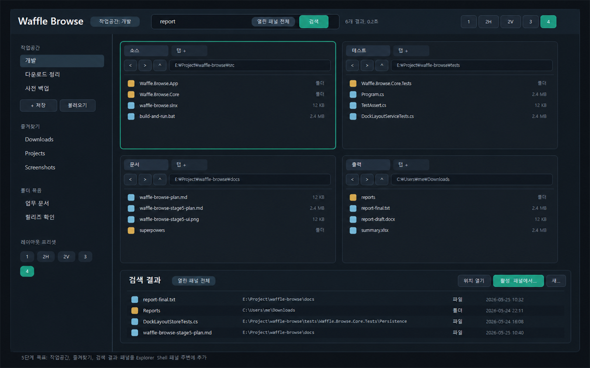

# Waffle Browse 5단계 고유 기능 Implementation Plan

> **For agentic workers:** REQUIRED SUB-SKILL: Use superpowers:subagent-driven-development (recommended) or superpowers:executing-plans to implement this plan task-by-task. Steps use checkbox (`- [ ]`) syntax for tracking.

**Goal:** 도킹 레이아웃이 안정화된 Waffle Browse 위에 작업공간, 즐겨찾기, 빠른 검색, 검색 결과 패널, 패널 이름, 레이아웃 프리셋을 추가한다.

**Architecture:** Windows Explorer Shell View는 파일 표시 영역으로 유지하고, Waffle Browse 고유 기능은 앱 레벨 상태와 보조 UI로 구현한다. `Waffle.Browse.Core`에는 작업공간, 즐겨찾기, 검색 모델과 순수 서비스 로직을 두고, `Waffle.Browse.App`은 WPF 화면, Shell 패널 연동, 사용자 명령 연결만 담당한다.

**Tech Stack:** C# 13, .NET 10, WPF, Windows Shell COM hosting, System.Text.Json, 현재 콘솔 기반 테스트 프로젝트

## Revision

2026-05-25 사용자 피드백에 따라 왼쪽 사이드바와 그 아래 기능/UI를 제거했다. 현재 앱에는 빠른 검색, 검색 결과 패널, 패널 이름, 상단 레이아웃 프리셋만 유지한다. 작업공간, 즐겨찾기, 폴더 묶음은 앱 화면과 코드에서 제거했다.

---

## 목표 UI



5단계 UI는 기존 상단 툴바와 1~4개 Explorer Shell 패널을 유지하면서 세 영역을 추가한다.

- 좌측 사이드바: 작업공간, 즐겨찾기, 레이아웃 프리셋, 자주 쓰는 폴더 묶음
- 상단 빠른 검색: 현재 패널 또는 열린 모든 패널 범위를 선택해 검색 실행
- 하단 검색 결과 패널: 결과 목록, 위치 열기, 활성 패널에서 열기, Shell 작업 실행

## 현재 상태 기준

이미 구현된 기반은 다음과 같다.

- `DockLayoutState`, `PanelState`, `TabState`로 패널, 탭, 경로, 탐색 히스토리를 저장한다.
- `DockLayoutService`가 1~4패널 프리셋, 탭 추가/닫기, 탭 이동, 도킹을 처리한다.
- `DockLayoutStore`가 마지막 레이아웃을 `%LocalAppData%\Waffle Browse\layout.json`에 저장하고 복원한다.
- `MainWindow`가 레이아웃 렌더링과 Shell 패널 이벤트를 연결한다.
- `ExplorerPanelControl`이 탭, 주소창, 탐색 버튼, Shell host 영역을 제공한다.

5단계는 이 구조를 유지한다. 파일 목록 자체를 직접 다시 만들지 않는다.

## 범위 결정

### 포함

- 빠른 파일/폴더 검색
- 현재 패널 범위 검색
- 열린 모든 패널 범위 검색
- 검색 결과 패널
- 검색 결과에서 위치 열기
- 검색 결과에서 활성 패널이나 새 탭으로 열기
- 즐겨찾기 폴더 저장, 삭제, 정렬
- 작업공간 저장, 불러오기, 덮어쓰기, 삭제
- 작업공간에 레이아웃, 패널, 탭, 경로, 패널 이름 저장
- 레이아웃 프리셋 바로 적용
- 자주 쓰는 폴더 묶음 열기
- 패널별 이름 지정

### 제외

- 전체 디스크 인덱싱 검색
- 파일 내용 검색
- Shell View 내부 파일 목록을 직접 필터링하는 기능
- 자체 파일 목록 UI 재구현
- 클라우드 동기화
- 태그, 메모, 색상 필터

현재 패널 안 필터 검색은 Shell View를 바꾸지 않고, 현재 패널 경로를 범위로 하는 결과 패널 검색으로 제공한다. Explorer Shell View 내부의 항목 표시를 직접 필터링하는 기능은 Shell 연동 위험이 크므로 후순위로 둔다.

## 저장 위치

5단계에서 새로 저장할 파일은 모두 `%LocalAppData%\Waffle Browse` 아래에 둔다.

| 파일 | 책임 |
| --- | --- |
| `layout.json` | 기존 마지막 도킹 레이아웃 |
| `workspaces.json` | 이름 있는 작업공간 목록 |
| `favorites.json` | 즐겨찾기 폴더와 폴더 묶음 |
| `settings.json` | 검색 기본 범위, 결과 제한, UI 패널 표시 상태 |

## 데이터 모델

### Workspace

작업공간은 기존 `DockLayoutState`를 그대로 포함한다. 별도 복사 모델을 만들지 않아 상태 변환 비용을 줄인다.

```csharp
namespace Waffle.Browse.Core.Workspaces;

public sealed record WorkspaceState
{
    public Guid Id { get; init; } = Guid.NewGuid();
    public string Name { get; init; } = string.Empty;
    public DateTimeOffset CreatedAt { get; init; } = DateTimeOffset.UtcNow;
    public DateTimeOffset UpdatedAt { get; init; } = DateTimeOffset.UtcNow;
    public DockLayoutState Layout { get; init; } = new();
}
```

### Favorites

즐겨찾기는 단일 폴더와 폴더 묶음을 분리한다. 폴더 묶음은 작업공간보다 가볍게 여러 경로를 현재 레이아웃에 여는 명령이다.

```csharp
namespace Waffle.Browse.Core.Favorites;

public sealed record FavoriteFolder
{
    public Guid Id { get; init; } = Guid.NewGuid();
    public string Name { get; init; } = string.Empty;
    public string Path { get; init; } = string.Empty;
    public int SortOrder { get; init; }
}

public sealed record FolderBundle
{
    public Guid Id { get; init; } = Guid.NewGuid();
    public string Name { get; init; } = string.Empty;
    public List<string> Paths { get; init; } = [];
    public int SortOrder { get; init; }
}
```

### Search

검색은 열린 패널 경로를 기준으로 파일 시스템을 열거하고 결과 패널에 표시한다.

```csharp
namespace Waffle.Browse.Core.Search;

public enum SearchScope
{
    CurrentPanel,
    AllOpenPanels
}

public enum SearchItemKind
{
    File,
    Folder
}

public sealed record SearchQuery(string Text, SearchScope Scope, int MaxResults);

public sealed record SearchResultItem(
    string Name,
    string FullPath,
    string ParentPath,
    SearchItemKind Kind,
    long? Size,
    DateTimeOffset? ModifiedAt);
```

## Task 1: 작업공간 저장 모델과 Store

**Files:**
- Create: `src/Waffle.Browse.Core/Workspaces/WorkspaceState.cs`
- Create: `src/Waffle.Browse.Core/Workspaces/WorkspaceStore.cs`
- Create: `tests/Waffle.Browse.Core.Tests/Workspaces/WorkspaceStoreTests.cs`
- Modify: `tests/Waffle.Browse.Core.Tests/Program.cs`

- [x] **Step 1: Write the failing tests**

```csharp
public static void WorkspaceStoreRoundTripsNamedWorkspace()
{
    var tempFile = Path.Combine(Path.GetTempPath(), "waffle-browse-tests", Guid.NewGuid().ToString("N"), "workspaces.json");
    var layout = new DockLayoutService().SetVisiblePanelCount(new DockLayoutService().CreateDefault(@"C:\"), 2);
    var workspace = new WorkspaceState { Name = "개발", Layout = layout };

    var store = new WorkspaceStore(tempFile);
    store.SaveAll([workspace]);
    var loaded = store.LoadAll(@"C:\", _ => true);

    TestAssert.Equal(1, loaded.Count, "One workspace should round-trip");
    TestAssert.Equal("개발", loaded[0].Name, "Workspace name should round-trip");
    TestAssert.Equal(2, loaded[0].Layout.VisiblePanels.Count, "Workspace layout should round-trip");
}

public static void WorkspaceStoreFallsBackForInvalidJson()
{
    var tempFile = Path.Combine(Path.GetTempPath(), "waffle-browse-tests", Guid.NewGuid().ToString("N"), "workspaces.json");
    Directory.CreateDirectory(Path.GetDirectoryName(tempFile)!);
    File.WriteAllText(tempFile, "{ invalid");

    var loaded = new WorkspaceStore(tempFile).LoadAll(@"C:\", _ => true);

    TestAssert.Equal(0, loaded.Count, "Invalid workspace JSON should return an empty list");
}
```

- [x] **Step 2: Run tests to verify they fail**

Run: `dotnet run --project tests/Waffle.Browse.Core.Tests/Waffle.Browse.Core.Tests.csproj`

Expected: compile failure because `WorkspaceState` and `WorkspaceStore` do not exist.

- [x] **Step 3: Implement workspace model and store**

Create `WorkspaceState` with `Id`, `Name`, `CreatedAt`, `UpdatedAt`, `Layout`.

Create `WorkspaceStore` with:

- `SaveAll(IReadOnlyList<WorkspaceState> workspaces)`
- `LoadAll(string fallbackPath, Func<string, bool>? isPathAvailable = null)`
- JSON options matching `DockLayoutStore`
- restore normalization through `DockLayoutStore.NormalizeForRestore`
- invalid JSON and IO failures returning an empty list

- [x] **Step 4: Register tests**

Add both test methods to `tests/Waffle.Browse.Core.Tests/Program.cs`.

- [x] **Step 5: Run tests**

Run: `dotnet run --project tests/Waffle.Browse.Core.Tests/Waffle.Browse.Core.Tests.csproj`

Expected: all tests pass.

## Task 2: 작업공간 서비스

**Files:**
- Create: `src/Waffle.Browse.Core/Workspaces/WorkspaceService.cs`
- Create: `tests/Waffle.Browse.Core.Tests/Workspaces/WorkspaceServiceTests.cs`
- Modify: `tests/Waffle.Browse.Core.Tests/Program.cs`

- [x] **Step 1: Write service tests**

```csharp
public static void SavingExistingWorkspaceReplacesLayoutAndUpdatesTimestamp()
{
    var service = new WorkspaceService();
    var firstLayout = new DockLayoutService().CreateDefault(@"C:\One");
    var secondLayout = new DockLayoutService().SetVisiblePanelCount(firstLayout, 4);
    var existing = new WorkspaceState
    {
        Id = Guid.NewGuid(),
        Name = "개발",
        CreatedAt = DateTimeOffset.Parse("2026-01-01T00:00:00Z"),
        UpdatedAt = DateTimeOffset.Parse("2026-01-01T00:00:00Z"),
        Layout = firstLayout
    };

    var saved = service.SaveWorkspace([existing], existing.Id, "개발", secondLayout, DateTimeOffset.Parse("2026-02-01T00:00:00Z"));

    TestAssert.Equal(1, saved.Count, "Existing workspace should be replaced, not duplicated");
    TestAssert.Equal(existing.Id, saved[0].Id, "Workspace identity should stay stable");
    TestAssert.Equal(4, saved[0].Layout.VisiblePanels.Count, "Updated layout should be stored");
    TestAssert.Equal(DateTimeOffset.Parse("2026-02-01T00:00:00Z"), saved[0].UpdatedAt, "Updated timestamp should change");
}

public static void LoadingWorkspaceReturnsStoredLayout()
{
    var service = new WorkspaceService();
    var layout = new DockLayoutService().SetVisiblePanelCount(new DockLayoutService().CreateDefault(@"C:\"), 3);
    var workspace = new WorkspaceState { Id = Guid.NewGuid(), Name = "사진 백업", Layout = layout };

    var loaded = service.GetWorkspaceLayout([workspace], workspace.Id);

    TestAssert.Equal(3, loaded.VisiblePanels.Count, "Workspace load should return its saved layout");
}
```

- [x] **Step 2: Implement service**

Methods:

- `SaveWorkspace(IReadOnlyList<WorkspaceState> current, Guid? id, string name, DockLayoutState layout, DateTimeOffset now)`
- `DeleteWorkspace(IReadOnlyList<WorkspaceState> current, Guid id)`
- `GetWorkspaceLayout(IReadOnlyList<WorkspaceState> current, Guid id)`

Reject empty workspace names with `ArgumentException`.

- [x] **Step 3: Run tests**

Run: `dotnet run --project tests/Waffle.Browse.Core.Tests/Waffle.Browse.Core.Tests.csproj`

Expected: all tests pass.

## Task 3: 즐겨찾기와 폴더 묶음

**Files:**
- Create: `src/Waffle.Browse.Core/Favorites/FavoriteFolder.cs`
- Create: `src/Waffle.Browse.Core/Favorites/FolderBundle.cs`
- Create: `src/Waffle.Browse.Core/Favorites/FavoritesState.cs`
- Create: `src/Waffle.Browse.Core/Favorites/FavoritesStore.cs`
- Create: `src/Waffle.Browse.Core/Favorites/FavoritesService.cs`
- Create: `tests/Waffle.Browse.Core.Tests/Favorites/FavoritesServiceTests.cs`
- Create: `tests/Waffle.Browse.Core.Tests/Favorites/FavoritesStoreTests.cs`
- Modify: `tests/Waffle.Browse.Core.Tests/Program.cs`

- [x] **Step 1: Write service tests**

```csharp
public static void FavoriteFoldersAreAddedWithStableSortOrder()
{
    var service = new FavoritesService();
    var state = new FavoritesState();

    state = service.AddFolder(state, "Downloads", @"C:\Users\me\Downloads");
    state = service.AddFolder(state, "Work", @"D:\Work");

    TestAssert.Equal(2, state.Folders.Count, "Two favorite folders should be added");
    TestAssert.Equal(0, state.Folders[0].SortOrder, "First folder should have first sort order");
    TestAssert.Equal(1, state.Folders[1].SortOrder, "Second folder should have second sort order");
}

public static void FolderBundleOpensIntoVisiblePanels()
{
    var dock = new DockLayoutService();
    var service = new FavoritesService();
    var layout = dock.CreateDefault(@"C:\");
    var bundle = new FolderBundle { Name = "업무 문서", Paths = [@"D:\Docs", @"D:\Reports", @"D:\Inbox"] };

    var next = service.ApplyBundle(layout, bundle);

    TestAssert.Equal(3, next.VisiblePanels.Count, "Bundle with three paths should open three panels");
    TestAssert.Equal(@"D:\Docs", next.VisiblePanels[0].ActiveTab?.CurrentPath, "First bundle path should open in first panel");
    TestAssert.Equal(@"D:\Reports", next.VisiblePanels[1].ActiveTab?.CurrentPath, "Second bundle path should open in second panel");
    TestAssert.Equal(@"D:\Inbox", next.VisiblePanels[2].ActiveTab?.CurrentPath, "Third bundle path should open in third panel");
}
```

- [x] **Step 2: Implement favorites model and store**

`FavoritesState` contains `List<FavoriteFolder> Folders` and `List<FolderBundle> Bundles`.

`FavoritesStore` persists one JSON file and returns an empty state on missing or invalid data.

- [x] **Step 3: Implement favorites service**

Methods:

- `AddFolder(FavoritesState state, string name, string path)`
- `RemoveFolder(FavoritesState state, Guid id)`
- `MoveFolder(FavoritesState state, Guid id, int targetIndex)`
- `AddBundle(FavoritesState state, string name, IReadOnlyList<string> paths)`
- `RemoveBundle(FavoritesState state, Guid id)`
- `ApplyBundle(DockLayoutState layout, FolderBundle bundle)`

`ApplyBundle` opens up to four paths by setting visible panel count to `Math.Min(4, bundle.Paths.Count)` and navigating each visible panel.

- [x] **Step 4: Run tests**

Run: `dotnet run --project tests/Waffle.Browse.Core.Tests/Waffle.Browse.Core.Tests.csproj`

Expected: all tests pass.

## Task 4: 검색 모델과 파일 시스템 검색 서비스

**Files:**
- Create: `src/Waffle.Browse.Core/Search/SearchScope.cs`
- Create: `src/Waffle.Browse.Core/Search/SearchItemKind.cs`
- Create: `src/Waffle.Browse.Core/Search/SearchQuery.cs`
- Create: `src/Waffle.Browse.Core/Search/SearchResultItem.cs`
- Create: `src/Waffle.Browse.Core/Search/FileSearchService.cs`
- Create: `tests/Waffle.Browse.Core.Tests/Search/FileSearchServiceTests.cs`
- Modify: `tests/Waffle.Browse.Core.Tests/Program.cs`

- [x] **Step 1: Write search tests**

```csharp
public static void SearchReturnsMatchingFilesAndFolders()
{
    var root = Path.Combine(Path.GetTempPath(), "waffle-browse-tests", Guid.NewGuid().ToString("N"));
    Directory.CreateDirectory(root);
    Directory.CreateDirectory(Path.Combine(root, "Reports"));
    File.WriteAllText(Path.Combine(root, "report-final.txt"), "x");
    File.WriteAllText(Path.Combine(root, "notes.txt"), "x");

    var results = new FileSearchService().Search([root], new SearchQuery("report", SearchScope.CurrentPanel, 50), CancellationToken.None);

    TestAssert.Equal(2, results.Count, "Search should find matching file and folder names");
    TestAssert.True(results.Any(item => item.Kind == SearchItemKind.File && item.Name == "report-final.txt"), "Matching file should be returned");
    TestAssert.True(results.Any(item => item.Kind == SearchItemKind.Folder && item.Name == "Reports"), "Matching folder should be returned");
}

public static void SearchSkipsUnavailablePathsAndRespectsLimit()
{
    var root = Path.Combine(Path.GetTempPath(), "waffle-browse-tests", Guid.NewGuid().ToString("N"));
    Directory.CreateDirectory(root);
    File.WriteAllText(Path.Combine(root, "alpha-1.txt"), "x");
    File.WriteAllText(Path.Combine(root, "alpha-2.txt"), "x");

    var results = new FileSearchService().Search([root, Path.Combine(root, "missing")], new SearchQuery("alpha", SearchScope.AllOpenPanels, 1), CancellationToken.None);

    TestAssert.Equal(1, results.Count, "Search should stop at the requested result limit");
}
```

- [x] **Step 2: Implement search service**

`FileSearchService.Search` should:

- return empty results for blank query text
- search directories first, then files, using case-insensitive `Contains`
- skip inaccessible directories and files by catching `UnauthorizedAccessException`, `IOException`, and `DirectoryNotFoundException`
- deduplicate roots and result paths case-insensitively
- stop when `MaxResults` is reached
- observe `CancellationToken.ThrowIfCancellationRequested`

- [x] **Step 3: Run tests**

Run: `dotnet run --project tests/Waffle.Browse.Core.Tests/Waffle.Browse.Core.Tests.csproj`

Expected: all tests pass.

## Task 5: 앱 Shell에 5단계 UI 골격 추가

**Files:**
- Modify: `src/Waffle.Browse.App/MainWindow.xaml`
- Modify: `src/Waffle.Browse.App/MainWindow.xaml.cs`
- Create: `src/Waffle.Browse.App/Controls/WorkspaceSidebar.xaml`
- Create: `src/Waffle.Browse.App/Controls/WorkspaceSidebar.xaml.cs`
- Create: `src/Waffle.Browse.App/Controls/SearchResultsPanel.xaml`
- Create: `src/Waffle.Browse.App/Controls/SearchResultsPanel.xaml.cs`

- [x] **Step 1: Add top search bar**

`MainWindow.xaml` 상단 툴바의 가운데 영역을 상태 텍스트만 표시하는 구조에서 검색 입력 구조로 바꾼다.

Controls:

- `TextBox x:Name="QuickSearchBox"`
- `ComboBox x:Name="SearchScopeBox"` with `Current panel`, `All open panels`
- `Button Content="검색"`
- `TextBlock x:Name="StatusText"`

- [x] **Step 2: Add left sidebar region**

`DockPanel` 안에 `WorkspaceSidebar`를 `DockPanel.Dock="Left"`로 배치한다.

Sidebar sections:

- 작업공간
- 즐겨찾기
- 폴더 묶음
- 레이아웃 프리셋

- [x] **Step 3: Add bottom search results region**

`WorkspaceRoot`와 결과 패널을 하나의 세로 `Grid`로 감싸고, 하단에 `SearchResultsPanel`을 둔다.

Default state: collapsed until a search runs.

- [x] **Step 4: Wire event shells**

`MainWindow.xaml.cs`에 다음 이벤트를 연결한다.

- quick search submitted
- search scope changed
- workspace save/load requested
- favorite opened
- folder bundle opened
- layout preset selected
- search result open location requested
- search result open in active panel requested

이 단계에서는 이벤트 핸들러가 컴파일되고 상태 텍스트를 갱신하는 수준까지 구현한다.

- [x] **Step 5: Build**

Run: `dotnet build waffle-browse.slnx`

Expected: build succeeds.

## Task 6: 작업공간과 즐겨찾기 UI 연결

**Files:**
- Modify: `src/Waffle.Browse.App/MainWindow.xaml.cs`
- Modify: `src/Waffle.Browse.App/Controls/WorkspaceSidebar.xaml.cs`
- Modify: `src/Waffle.Browse.App/Controls/WorkspaceSidebar.xaml`

- [x] **Step 1: Initialize stores**

Create these stores in `MainWindow` using `%LocalAppData%\Waffle Browse`:

- `WorkspaceStore(Path.Combine(appDataPath, "workspaces.json"))`
- `FavoritesStore(Path.Combine(appDataPath, "favorites.json"))`

- [x] **Step 2: Load sidebar data on startup**

In `OnLoaded`, load workspaces and favorites after layout restore, then call `WorkspaceSidebar.Update(...)`.

- [x] **Step 3: Save current workspace**

When user saves a workspace:

- use entered name if creating a new workspace
- preserve selected workspace id if overwriting
- call `WorkspaceService.SaveWorkspace`
- persist through `WorkspaceStore.SaveAll`
- refresh sidebar

- [x] **Step 4: Load workspace**

When user selects a workspace:

- get layout through `WorkspaceService.GetWorkspaceLayout`
- set `layoutState`
- call `RenderLayout`
- save as the last layout through `SaveLayout`

- [x] **Step 5: Open favorite folder**

When user opens a favorite:

- navigate active panel if one exists
- otherwise create a single-panel layout and navigate it

- [x] **Step 6: Open folder bundle**

Call `FavoritesService.ApplyBundle(layoutState, bundle)` and then `ApplyLayout`.

- [x] **Step 7: Build and run tests**

Run:

```powershell
dotnet run --project tests/Waffle.Browse.Core.Tests/Waffle.Browse.Core.Tests.csproj
dotnet build waffle-browse.slnx
```

Expected: tests and build pass.

## Task 7: 검색 실행과 결과 작업

**Files:**
- Modify: `src/Waffle.Browse.App/MainWindow.xaml.cs`
- Modify: `src/Waffle.Browse.App/Controls/SearchResultsPanel.xaml.cs`
- Modify: `src/Waffle.Browse.App/Controls/SearchResultsPanel.xaml`

- [x] **Step 1: Resolve search roots**

For `SearchScope.CurrentPanel`, use active panel active tab path.

For `SearchScope.AllOpenPanels`, use visible panels' active tab paths.

Remove blank paths and deduplicate case-insensitively.

- [x] **Step 2: Run search asynchronously**

Use a `CancellationTokenSource` field in `MainWindow`.

On each new search:

- cancel the previous search
- set status to `Searching...`
- run `FileSearchService.Search` on a background task
- update results on the WPF dispatcher
- show result count in `StatusText`

- [x] **Step 3: Open result location**

For a file result, navigate the active panel to `ParentPath`.

For a folder result, navigate the active panel to `FullPath`.

- [x] **Step 4: Open result in new tab**

For a file result, add a tab for `ParentPath`.

For a folder result, add a tab for `FullPath`.

- [x] **Step 5: Execute Shell open**

For `Open in Explorer`, reuse the existing `OpenFolderInExplorer` pattern and pass the folder path.

- [x] **Step 6: Build**

Run: `dotnet build waffle-browse.slnx`

Expected: build succeeds.

## Task 8: 레이아웃 프리셋 완성

**Files:**
- Modify: `src/Waffle.Browse.Core/Docking/DockLayoutService.cs`
- Modify: `tests/Waffle.Browse.Core.Tests/Docking/DockLayoutServiceTests.cs`
- Modify: `src/Waffle.Browse.App/Controls/ExplorerPanelControl.xaml`
- Modify: `src/Waffle.Browse.App/Controls/ExplorerPanelControl.xaml.cs`
- Modify: `src/Waffle.Browse.App/Controls/WorkspaceSidebar.xaml`
- Modify: `src/Waffle.Browse.App/Controls/WorkspaceSidebar.xaml.cs`
- Modify: `src/Waffle.Browse.App/MainWindow.xaml.cs`

- [x] **Step 1: Add layout preset commands**

Sidebar preset commands call existing layout methods:

- 1 panel: `SetVisiblePanelCount(layoutState, 1)`
- 2 columns: `SetLayout(layoutState, DockLayoutKind.OneByTwo)`
- 2 rows: `SetLayout(layoutState, DockLayoutKind.TwoByOne)`
- 3 panels: `SetVisiblePanelCount(layoutState, 3)`
- 4 panels: `SetVisiblePanelCount(layoutState, 4)`

- [x] **Step 2: Run tests and build**

Run:

```powershell
dotnet run --project tests/Waffle.Browse.Core.Tests/Waffle.Browse.Core.Tests.csproj
dotnet build waffle-browse.slnx
```

Expected: tests and build pass.

## Task 9: 상태 저장, 실패 처리, 수동 검증

**Files:**
- Modify: `src/Waffle.Browse.App/MainWindow.xaml.cs`
- Modify: `docs/waffle-browse-plan.md`
- Modify: `docs/waffle-browse-stage5-plan.md`

- [x] **Step 1: Persist UI state**

Persist these settings in `settings.json`:

- sidebar collapsed state
- search result panel height
- last selected search scope
- search result limit

- [x] **Step 2: Handle restore failures**

Display non-blocking status messages for:

- missing workspace paths
- inaccessible favorite paths
- deleted bundle paths
- search root access denied

Do not block app startup for any of these failures.

- [x] **Step 3: Manual verification**

Run the app and verify:

- saving a workspace restores the same 1x1, 1x2, 2x1, 2x2, or 3-panel layout
- panel names survive app restart
- favorite folder opens in the active panel
- folder bundle opens multiple panels
- current panel search returns matching file and folder names
- all open panels search deduplicates overlapping paths
- search result opens the containing folder
- Shell context menu still works inside Explorer panels
- tab drag docking still works while sidebar and result panel exist

Status: automated tests, build, and interactive WPF smoke verification are passing. Left sidebar verification items are obsolete after the 2026-05-25 sidebar removal revision.

Automated UI verification covered:

- app startup with sidebar, quick search, panel name, address controls visible
- 1, 2H, 2V, 3, 4 layout preset buttons rendering the expected visible panel counts
- workspace save persistence through `workspaces.json`
- panel name persistence after app restart
- favorite folder save and active-panel open
- folder bundle save and multi-panel open
- quick search result visibility
- search result location command for a file result
- Shell context menu popup from the hosted Explorer area
- tab drag docking to a second panel while sidebar and search results are present

- [x] **Step 4: Update main plan**

In `docs/waffle-browse-plan.md`, mark 5단계 세부 계획 문서 as available by linking to this file.

## Acceptance Criteria

- 사용자는 현재 레이아웃을 이름 있는 작업공간으로 저장하고 나중에 불러올 수 있다.
- 작업공간은 레이아웃, 패널 구성, 탭, 경로, 패널 이름을 복원한다.
- 사용자는 즐겨찾기 폴더를 저장하고 활성 패널 또는 새 탭으로 열 수 있다.
- 사용자는 폴더 묶음을 한 번에 열어 여러 패널에 배치할 수 있다.
- 사용자는 현재 패널 또는 열린 모든 패널 범위로 빠른 검색을 실행할 수 있다.
- 검색 결과 패널에서 결과 위치를 열거나 활성 패널에 표시할 수 있다.
- 1~4패널 레이아웃, 탭 드래그 도킹, Shell 우클릭 메뉴는 기존과 동일하게 유지된다.
- 검색 중 접근 불가 경로가 있어도 앱이 중단되지 않는다.

## Verification Commands

```powershell
dotnet run --project tests/Waffle.Browse.Core.Tests/Waffle.Browse.Core.Tests.csproj
dotnet build waffle-browse.slnx
```

## Risks

- Shell View 내부 항목을 직접 필터링하면 Explorer 호스팅 안정성을 해칠 수 있다. 5단계에서는 결과 패널 검색으로 제한한다.
- 대형 폴더 재귀 검색은 느릴 수 있다. 초기 버전은 결과 제한과 취소 기능을 반드시 둔다.
- 작업공간이 오래되어 경로가 사라질 수 있다. 복원 실패는 앱 전체 실패가 아니라 fallback 경로와 상태 메시지로 처리한다.
- 사이드바와 검색 결과 패널이 추가되면 Shell HWND 리사이즈와 포커스 문제가 다시 생길 수 있다. 마지막 검증에서 도킹, 컨텍스트 메뉴, 키보드 탐색을 함께 확인한다.
